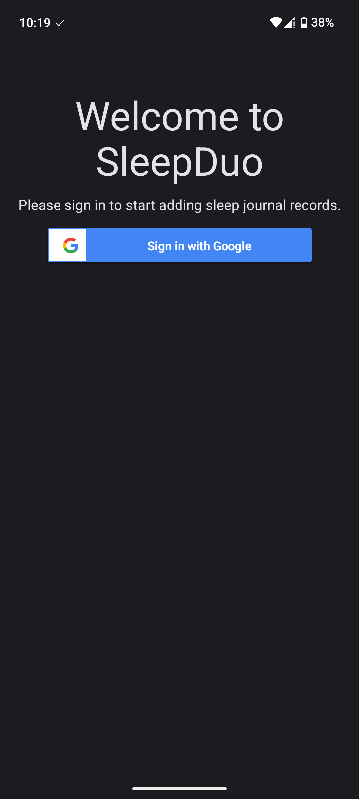
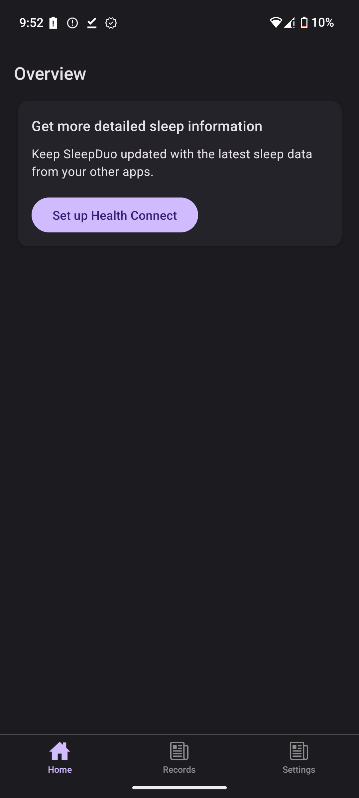
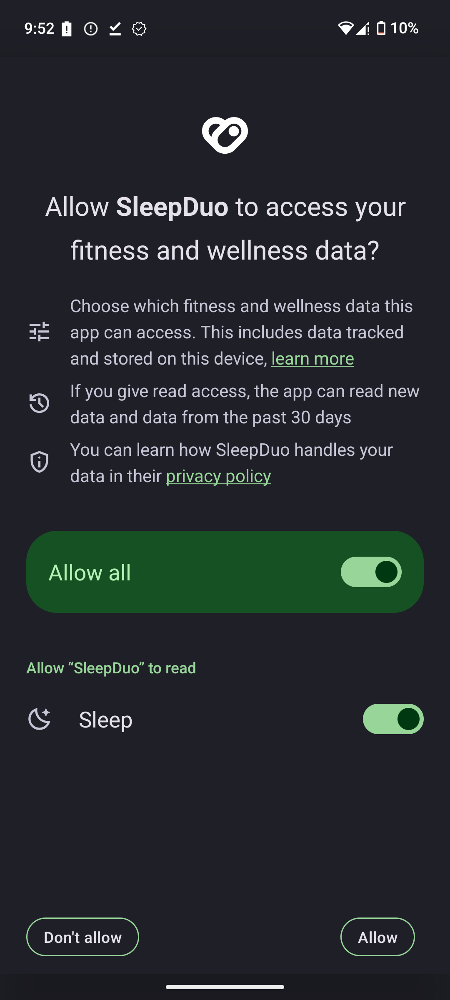
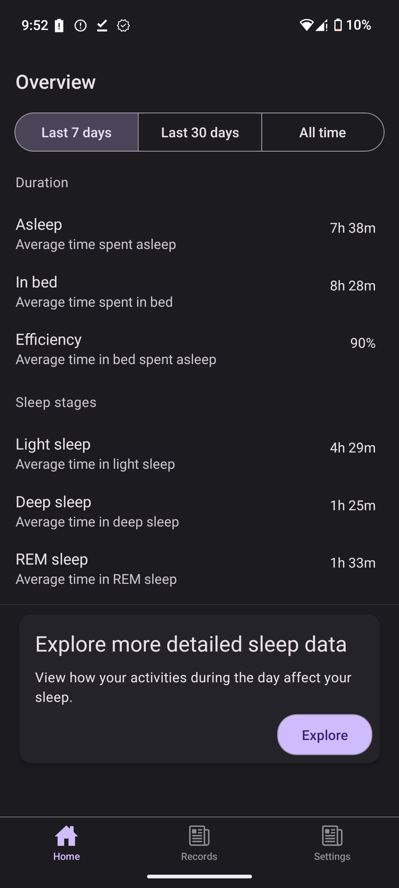
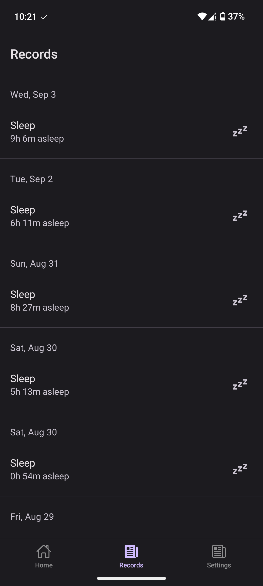
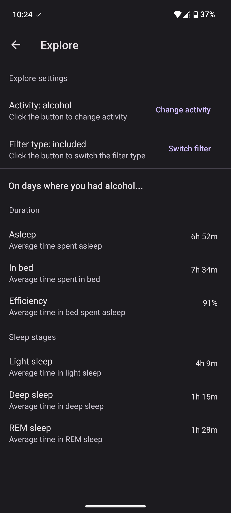

# Welcome to SleepDuo

Sleep smarter with SleepDuo, an Android app that combines a sleep diary with advanced sleep tracking. Log your daily activities and see how they affect your rest, all in one place.

SleepDuo integrates seamlessly with Health Connect, keeping your data up to date across your favorite apps and devices. Whether you use a Fitbit, Garmin, Oura Ring, or any other Health Connect–compatible wearable, SleepDuo fits right into your routine.

## Download

Download link here

## Setup

Getting started takes just a minute:

1. Sign in with your Google account when you open the app.

2. Tap “Set up Health Connect” to grant SleepDuo permission to read your sleep data.

## How it works
Once setup is complete, your tracked sleep sessions will appear automatically in the Records tab.

* Home Overview – See your average sleep time, efficiency, and time in each sleep stage at a glance.

* Detailed Records – Tap a session to view insights, then add personal logs (e.g., caffeine/alcohol consumption).

* Explore Insights – Filter and analyze your data. For example, compare nights when you logged alcohol consumption with nights when you didn’t.

